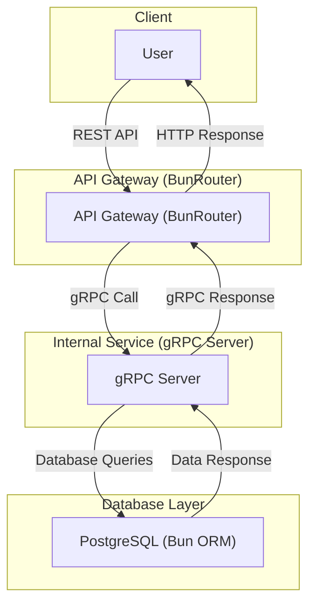

# Dead Simple Task tracking application

### Architectural decisions:

- Follows a microservices architecture
- Uses a RESTful API for external communication and gRPC for internal communication
- Fully containerized using Docker
- And, Bootstrapped using Docker Compose

## System Architecture



### **How It Works:**

- **User** makes HTTP requests to the **API Gateway**.
- **API Gateway** translates requests into **gRPC** calls to the **Internal Service**.
- **Internal Service** communicates with **PostgreSQL** using **Bun ORM**.
- Responses flow back **through the same pipeline** to the user.

## Installation

## Usage

This application is fully containerized, however, we have provided a `Makefile` to make usability easier, be it development or just exploring.

To get started, you are required to first set your environment variables in the `.env` file. You can copy the `.env.template` file and rename it to `.env` (please, keep it within the `config/` folder) and fill in the required fields.

Below are the commands you can use to interact with the application:

- To hit the ground running, you can use the following command to start the application:

```bash
make run
```

This runs the application within a Docker container, and you can access the application on `http://localhost:8080` or a provided port of choice
from your environment.

- To stop the application (containerized version), you can use the following command:

```bash
make stop
```

- To clean up the application, you can use the following command:

```bash
make clean
```

- To run the application in development mode, you can use the following command:

```bash
make serve
```

This runs the application (gRPC & API Gateway (manual mode, non-Docker)) on your local machine, and you can access the application on `http://localhost:8080` or a provided port of choice from your environment.
This was heavily insipired by Mintlify's `mintlify dev`, Yarn's `yarn serve` and python's `python -m http.server` commands.

- To start them individually, you can use the following commands:

```bash
make grpc
```

to run the gRPC server and

```bash
make gateway
```

to run the API Gateway.

- To run the tests, you can use the following command:

```bash
make test

```

For additional commands, you can check the `Makefile` for more information. or run `make help` to see all available commands.

## Contributing

Pull requests are welcome. For major changes, please open an issue first to discuss what you would like to change.

## License

[MIT](https://choosealicense.com/licenses/mit/)

