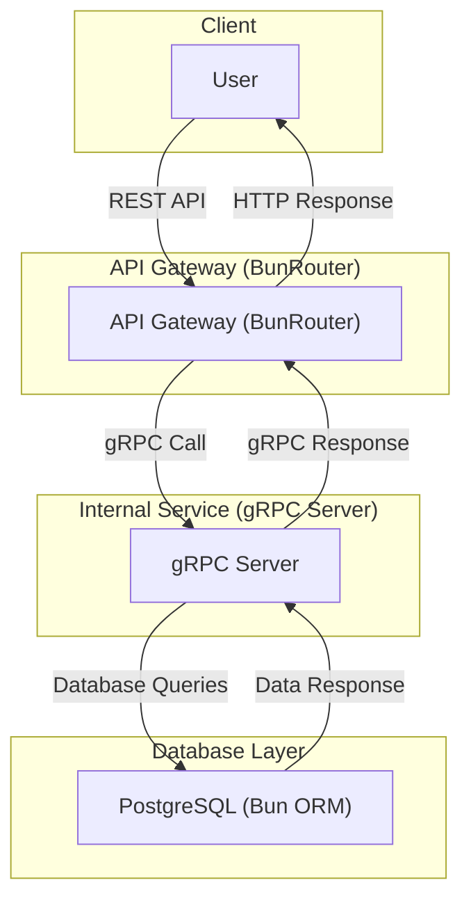

# Dead Simple Task tracking application

### Architectural decisions:

- Follows a microservices architecture
- Uses a RESTful API for external communication and gRPC for internal communication
- Fully containerized using Docker
- And, Bootstrapped using Docker Compose

## System Architecture

### **How It Works:**

- **User** makes HTTP requests to the **API Gateway**.
- **API Gateway** translates requests into **gRPC** calls to the **Internal Service**.
- **Internal Service** communicates with **PostgreSQL** using **Bun ORM**.
- Responses flow back **through the same pipeline** to the user.

## Installation

## Usage

## Contributing

## License
