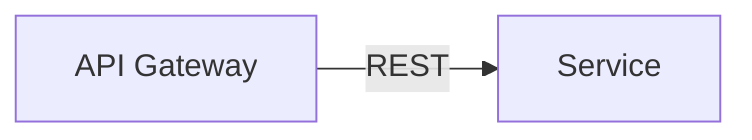

# Dead Simple Task tracking application

### Architectural decisions:

- Follows a microservices architecture
- Uses a RESTful API for external communication and gRPC for internal communication
- Fully containerized using Docker
- And, Bootstrapped using Docker Compose

## System Architecture

## Installation

## Usage

## Contributing

## License
